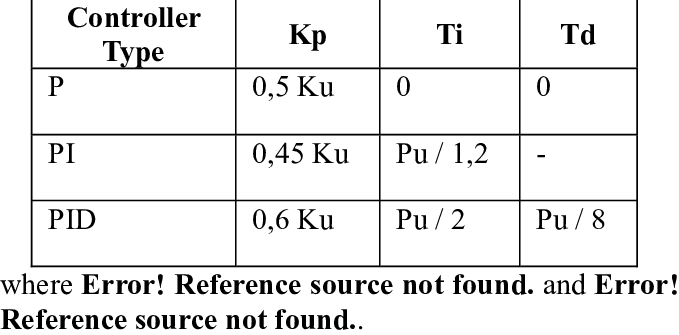
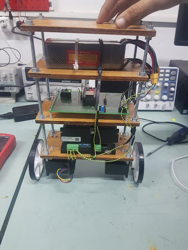

# PID_Controller_for_self_balancing_robot
This Repo Demonstrates a self-balancing robot, equipped with an MPU6050 sensor and stepper motors, controlled by a PID controller implemented on an Arduino. The robot reads the tilt angle from the MPU6050 sensor and adjusts the motor speed to maintain balance using a PID Controller.

For more details, you can refer to [this document](https://www.diva-portal.org/smash/get/diva2:1737768/FULLTEXT01.pdf). which has been used as a reference to make this robot
### PID Controller :
A PID controller **(Proportional-Integral-Derivative)** is a control mechanism that adjusts a system's output based on the error between the desired setpoint and the actual process variable. It does so by combining three terms: the **proportional term** reacts to the current error, the **integral term** accounts for the accumulated past error, and the **derivative term** predicts future error by observing the rate of change. The total output is the sum of these three components, given by the formula: 

The PID controller equation used in this project is:

`PID(error) = Kp * error + Ki * integral(e(t) dt) + Kd * de/dt`

Where:
-  **Kp** is the proportional gain
-  **Ki** is the integral gain
-  **Kd** is the derivative gain
-  **e(t)** is the error at time \( t \)

### Tuning the PID :

There are several methods to Tune the PID, manual tuning, the Ziegler-Nichols method, and trial and error, each aiming to optimize system stability and response time. 

Here the method used is **The Nicolas-Ziegler Method** :
# The Nicolas-Ziegler Method : 
The Ziegler-Nichols method is a heuristic tuning method for PID controllers. It involves setting the integral and derivative gains to zero and increasing the proportional gain until the system reaches the ultimate gain, where the output of the system oscillates with a constant amplitude. From the oscillation period and the ultimate gain.the PID controller gains are set using predefined formulas:

 

### Realization of the self-balancing robot :

